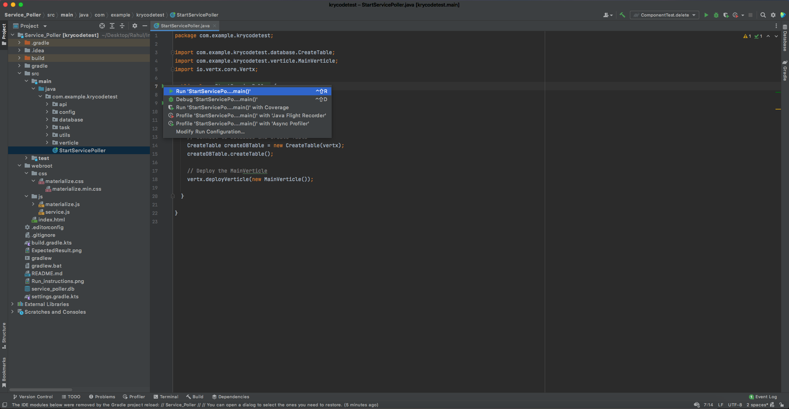
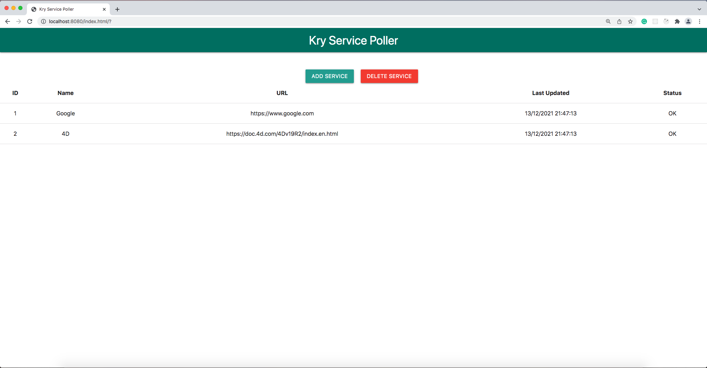

# Service poller

## Summary
As a part of scaling the number of services running within a modern health tech
company we need a way to make sure that all are running smoothly.
None of the tools that we have been looking for are quite doing the
right thing for us so we decided that we need to build it ourselves.
What we want you to do is to build a simple service poller that keeps
a list of services (defined by a URL), and periodically does a HTTP GET
to each and saves the response ("OK" or "FAIL"). Apart from the polling logic
we want to have all the services visualised and easily managed in a basic UI
presenting all services together with their status.

## Basic Requirements
 - A user needs to be able to add a new service with URL and a name
 - Added services have to be kept when the server is restarted
 - Display the name, url, creation time and status for each service
 - Provide a README in english with instructions on how to run the
application

## Extra requirements
 - We want full create/update/delete functionality for services
 -  The results from the poller are automatically shown to the user (no
need to reload the page to see results)
 -  We want to have informative and nice looking animations on
add/remove services
 -  The service properly handles concurrent writes
 -  Protect the poller from misbehaving services (for example answering
really slowly)
 -  URL Validation ("sdgf" is probably not a valid service)
 -  Multi user support. Users should not see the services added by
another user

# Building
The recommended tool is IntelliJ IDEA.
```
-> Download ZIP or Clone the repository
-> Open IntelliJ IDEA
-> Pre-requisite:
   -> Project SDK must be setup (Java v11.0.2 (SE) is used in the project)
-> Cick "Open" -> Select Project from disk -> Load Gradle Project
```

Run java program "StartServicePoller" as shown in below screenshot to start the server:


Alternatively, go to Terminal and run gradle command to start the server:
```
./gradlew clean run
```
If there is a permission issue when executing the above command, then run the below command in terminal:
```
chmod +x gradlew
./gradlew clean run
```


- Notes: Build has been tested in macOS(High Sierra v10.13.6) only.
- Known issue: The project might not be compatible with other Java versions (such as v10 or v15).

# Testing
Open any web browser and enter the below URL:
```
http://localhost:8080/
```
After adding few services, it must look like in below screenshot:


# Things done
I was able to complete all the basic requirements and some extra requirements:
- Basic requirements:
  - Add new service with url, and a name
  - Added services are kept/shown when the server is restarted
  - Basic UI presenting all services with Last change made and status
  - When ever a service is added, it is presented in the UI without reloading the page
  - Periodic poller running in the server every 30 seconds. The page must be reloaded to see the updated results
- Extra requirements:
  - URL Validation
  - Delete service (based on ID)

## Technology Stack/ Frameworks used

- Frontend
  - HTML5
  - CSS ([Materialize](https://materializecss.com))
  - JavaScript
- Backend
  - Java programming language
  ```
    Java version 11.0.2 is used
    Gradle does not support Java 16 or later versions.
  ```
  - [Eclipse Vert.x](https://vertx.io) (v4.0.3)
- Database
  - SQLite using JDBC API


